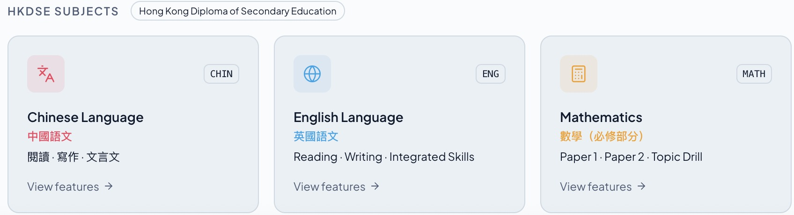
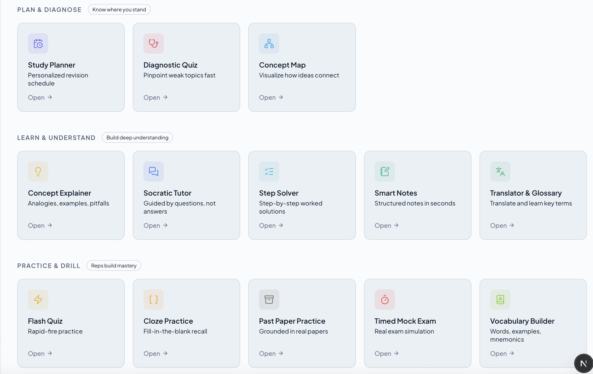
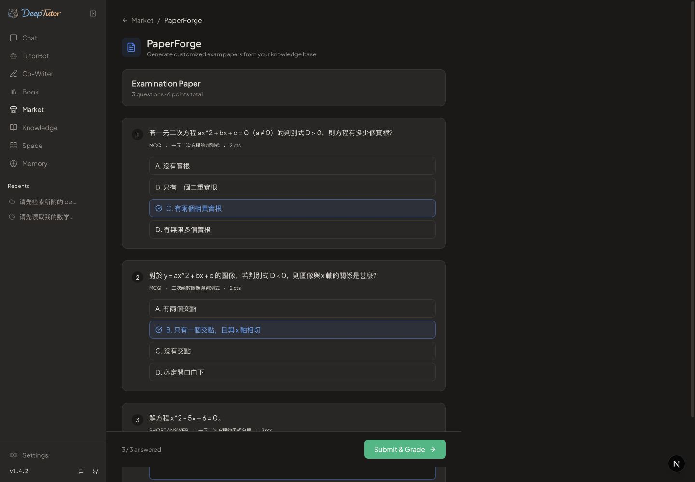
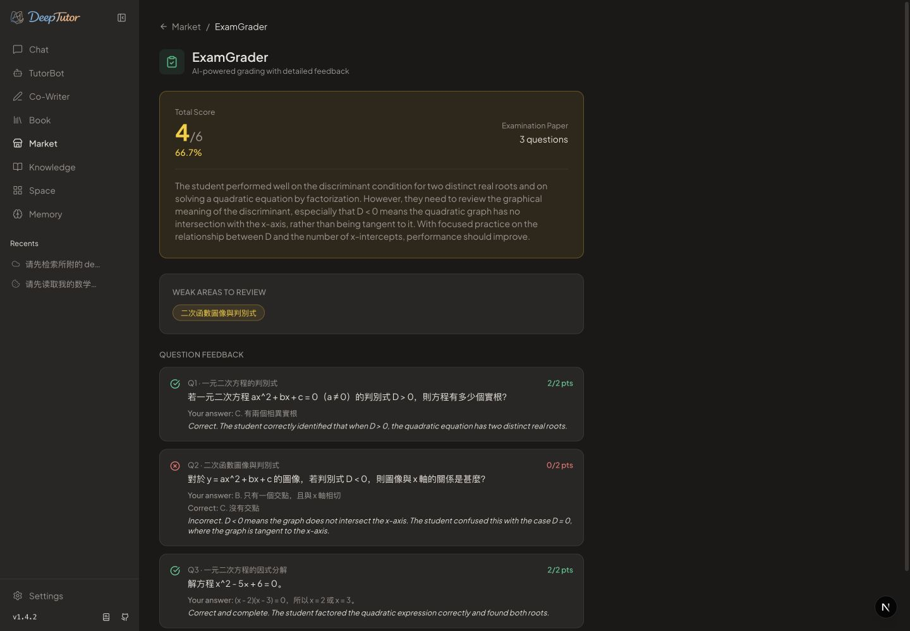
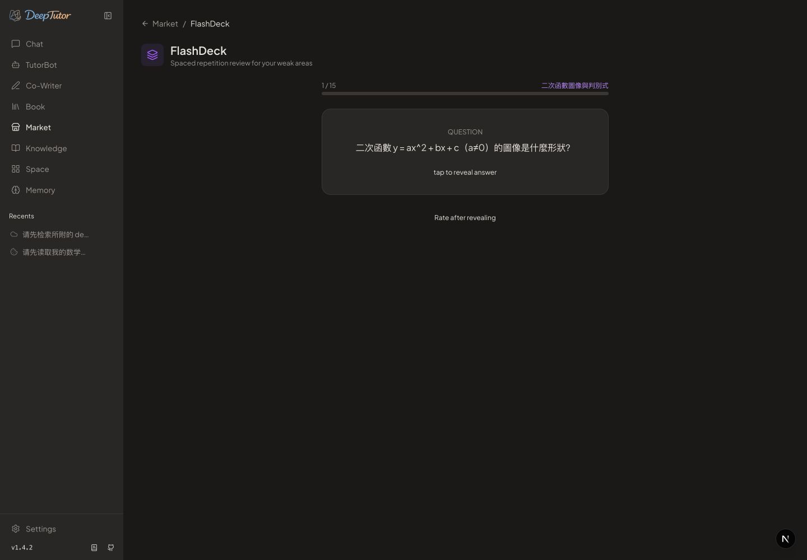
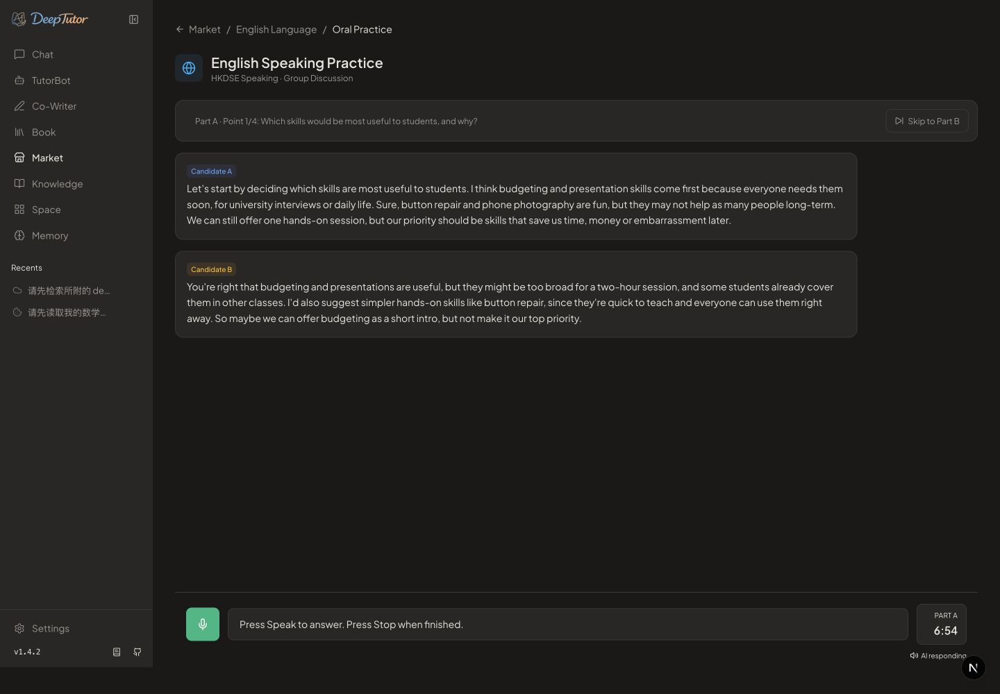

# DeepTutor-HKDSE

基于开源 DeepTutor 二次开发的香港 DSE 智能学习辅助系统，面向中文、英文、数学备考，提供诊断、讲解、练习、批改与复习功能。

系统提供对话式学习和学科学习工作台两种使用方式。你可以通过聊天进行数学诊断与练习，也可以在工作台选择学科，完成试卷练习、口语模拟，并根据反馈继续练习或复习。

技术栈：Python、FastAPI、Next.js / React、SQLite、LlamaIndex、LLM 工具调用、Dense / BM25 / RRF 检索。

## 快速体验

首次使用请按 [快速体验指南](docs/QUICKSTART.md) 安装、配置模型并走通数学 Agent、英语口语、Learning Loop 和课程检索。仓库已提供 [中英数小型示例材料](examples/hkdse/README.md)，不需要作者的本地数据。

数学 Agent 和口语需要 LLM 服务；知识库检索另需 Embedding 服务。请使用自己的凭据，示例索引会在本地生成。

## 界面预览

中英数学科入口：



学习计划、诊断、讲解与练习工具入口：



## 功能入口

| 场景 | 入口与用途 |
| --- | --- |
| 学习对话 | 聊天工作区：在工具可用的上下文中读取数学学习记录、讲解、出题、等待作答并评分 |
| Learning Loop | 试卷生成 → 作答与批改 → 根据本次薄弱项再练或生成闪卡；保留学科与知识库上下文 |
| 中文工作台 | 阅读分析、试卷生成、作文批改 |
| 英文工作台 | 试卷生成、写作练习、综合任务、多角色口语模拟 |
| 数学工作台 | 知识点练习、解题步骤检查；同时提供对话式数学诊断链路 |
| 共享学习工具 | 概念讲解、闪卡、测验、学习计划等；具体能力与输入要求见页面 |

## 从源码运行

需要 Python 3.11+ 和可运行 Next.js 16 的 Node.js（建议 Node.js 22 LTS）。在本仓库根目录：

```sh
python -m venv .venv
source .venv/bin/activate
python -m pip install -e '.[dev]'
cd web
npm ci
cd ..
python -m deeptutor_cli start
```

以上安装的是当前源码，而不是 PyPI 上的原版应用。启动输出会给出访问地址；默认后端端口 8001、前端端口 3782，可通过运行设置修改。首次使用须配置自己的模型服务，知识库功能需要导入自己有权使用的资料。

## 首次配置

1. 打开启动日志中的前端地址，在设置中填写模型服务的端点、模型名称和 API Key。
2. 如需使用知识库，单独配置 Embedding 服务，再导入有权使用的课程资料。聊天模型与 Embedding 模型的配置互相独立。
3. 返回聊天工作区或 Market，选择要使用的学科与功能；需要课程上下文的页面应选择相应知识库。

运行设置默认保存在 `data/user/settings/`，根目录 `.env` 不会自动加载。本仓库不携带 API 密钥、用户记录、预构建向量库或第三方试卷原文。

## 基本使用

### 对话式数学学习

在聊天工作区提出需求，例如“根据我的学习记录安排一道数学练习”。工具可用时，系统可以读取学习状态、生成题目并等待作答，提交后返回评分并保存学习记录。

### 试卷练习与复习

从学科试卷生成页面或通用试卷工具开始，选择学科、知识库及练习内容。完成作答后进入批改，根据本次反馈中的薄弱项继续针对性练习，或生成闪卡复习。再练会沿用原练习的学科与知识库；知识库已删除时需重新确认，系统不会静默替换。

首次体验可以从三道题开始：

1. 按快速体验指南导入数学示例，在 Market → PaperForge 中填写学科 `HKDSE Mathematics`，选择 `demo-hkdse-maths` 知识库，将题数设为 3、难度设为 Easy。
2. 点击 Generate Paper；选择题直接点选答案，简答题填写解答，完成后点击 Submit & Grade。
3. 在批改页查看逐题反馈与 Weak Areas to Review。点击 Review with FlashDeck 复习本次薄弱项，或 Retake Exam 继续练习。再练时可重新调整题数和难度。

以下为使用仓库示例材料的实际运行截图，题目和模型反馈每次可能不同。

[](docs/images/paper-practice.jpg)

批改页将得分、错题原因与后续复习入口放在一起：

[](docs/images/grading-feedback.jpg)

从本次反馈进入闪卡页，点击卡片查看答案，再按掌握程度标记：

[](docs/images/flashcard-review.jpg)

### 英语口语模拟

建议使用桌面版 Google Chrome 体验口语功能。播报使用浏览器自带 TTS，不同浏览器与操作系统提供的音色、音质可能不同；若在应用内浏览器中听到明显机械音，请尝试在 Chrome 中打开。此建议不保证所有设备音质一致。

进入英文工作台的口语模拟页面，配置话题后按页面提示完成准备、讨论和个人回答。语音输入需要浏览器权限，语音识别与播报可用性取决于浏览器和设备；刷新页面不会恢复上一场口语会话。

内置教育、科技、环境和社会议题四类原创演示材料，包含背景短文、小组讨论任务及个人回答问题，可直接用于体验。它们是虚构练习场景，不是官方试题。

在英文工作台选择 Oral Practice → Education & Learning → Start Practice，阅读准备材料后进入讨论；快速体验时可点击 Skip Preparation & Start Discussion。轮到自己时按 Speak 开始、Stop 结束，Skip to Part B 可进入个人回答阶段。

三位模拟考生与考官优先使用不同英语音色，不通过变调区分角色；实际音色取决于浏览器和系统可用语音，数量不足时会复用。

[](docs/images/oral-discussion.jpg)

## 文档

- [快速体验](docs/QUICKSTART.md)：模型配置、示例导入与四条操作路线。
- [开发指南](docs/DEVELOPMENT.md)：配置、启动与测试命令。
- [系统架构](docs/ARCHITECTURE.md)：模块职责、调用路径与状态管理。
- [测试与检索评测](docs/EVIDENCE.md)：测试范围、实验参数、结果与局限。
- [来源与许可](docs/ATTRIBUTION.md)：开源基础及第三方资料说明。

## 使用边界

模型生成的题目、答案与主观反馈可能出错，使用时应结合课程资料核查。外部模型与 Embedding 服务可能产生费用；请勿提交敏感学生信息，也不要将默认未启用认证的开发服务直接暴露到公网。

## 开源基础

底层 Agent 运行时、通用能力及部分界面继承自 HKUDS DeepTutor，本项目在其上扩展 HKDSE 学习场景。来源及改动范围见 [来源与许可](docs/ATTRIBUTION.md)，代码许可见 [LICENSE](LICENSE)。
